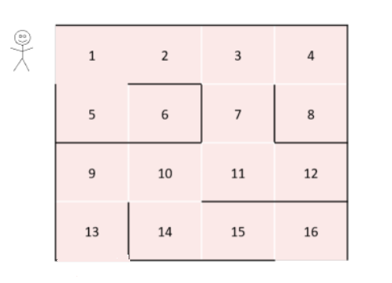

# Backtracking
En el ámbito de la ciencia de la computación existen una amplia variedad de problemas donde es necesario **explorar exhaustivamente un conjunto finito de posibles soluciones** para encontrar aquellas que cumplan con ciertas condiciones o restricciones.

## Características de los problemas

Los problemas mencionados comparten las siguientes características.

- **Espacio de soluciones finito**: Los problemas tienen un espacio de soluciones finito y bien definido. Esto implica que podríamos enumerar todas las posibles soluciones de manera sistemática y exhaustiva.

- **Restricciones o condiciones explícitas**: Los problemas deben tener restricciones claras y bien definidas que las soluciones deben cumplir. Estas restricciones pueden estar relacionadas con la validez de la solución, limitaciones de tiempo o recursos, o cualquier otro criterio específico del problema.

- **Solución satisfactoria**: En algunos casos, se busca encontrar **la solución óptima** que satisfaga ciertos criterios predefinidos. En otros casos, el objetivo puede ser simplemente encontrar **cualquier solución válida**. Es importante tener en cuenta cuál es el objetivo final del problema para determinar si se busca una solución óptima o simplemente identificar todas las válidas.

## Resolución por fuerza bruta

Una estrategia posible para resolver este tipo de problemas es utilizar la _fuerza bruta_ para encontrar las soluciones satisfactorias. Esta búsqueda dentro de un espacio de soluciones **reducido** puede resultar válida y aceptable. En ese caso, podemos **generar todas las soluciones posibles** (el espacio de soluciones completo) y seleccionar aquellas que resultan ser soluciones válidas u óptimas.

La dificultad de esta estrategia surge cuando el espacio de soluciones posibles empieza a ser muy grande. Esto es común cuando hablamos de **problemas de explosión combinatoria**, donde es muy probable que sea muy costoso (o directamente inviable) generar el conjunto completo de soluciones para probar cada una de ellas.

## El concepto de backtracking

Cuando vemos que la estrategia previa no es viable, podemos aplicar la idea de backtracking. Es una **técnica de resolución de problemas** que se basa en la **exploración sistemática de todas las posibles soluciones** para encontrar **aquellas que cumplen con ciertas restricciones o condiciones**. Es especialmente útil cuando se enfrentan problemas combinatorios o de búsqueda, donde se debe probar una serie de opciones para encontrar la solución óptima o satisfactoria. En general resulta práctico para algunos problemas donde la **solución no es determinística**, es decir, no existe un curso de acción que nos permita llegar siempre a la solución.

> Backtracking es una estrategia de resolución no determinística de problemas

Si bien puede parecer una estrategia similar a la de _fuerza bruta_, la ventaja en eficiencia de esta técnica se apoya en que puede **descartar previamente soluciones parciales que sabemos que no construirán una solución óptima o válida**. Este descarte permite reducir notablemente el conjunto completo de soluciones posibles sobre el cual buscaremos.

Al aplicar backtracking con operaciones recursivas, en cada llamada recursiva **exploramos una rama del árbol de posibles soluciones** y, si llegamos a un punto en el que **no se satisfacen ciertas condiciones**, **retrocedemos** (_backtrack_) y **probamos otra opción**. Básicamente, estaremos resolviendo el problema mediante la **prueba y error**.

## El diseño con backtracking
Si bien cada problema tendrá una resolución diferente, podemos generalizar algunas pautas para tener presente durante el proceso de diseño para soluciones con esta técnica.

1. **El problema**: El primer paso al diseñar cualquier algoritmo es identificar correctamente el problema a resolver y analizar si cumple las [características mencionadas](#características-de-los-problemas).

2. **Solución parcial y la solución final**: Debemos definir la generación de **soluciones parciales** que iremos construyendo paso a paso hasta llegar a una **solución válida**. También es importante identificar cuándo hemos alcanzado una **solución final** que cumple con todas las condiciones del problema.

3. **Exploración exhaustiva**: Probamos todas las opciones posibles para construir la solución mediante llamadas recursivas que nos permiten **explorar diferentes ramas de un árbol de soluciones**. Cada rama del árbol representa una solución posible que se construye mientras cumpla las restricciones o condiciones necesarias.

4. **Rechazo y retroceso**: Si llegamos a un punto donde no podemos seguir avanzando sin violar alguna restricción, **se descarta esa solución parcial y debemos retroceder** (_backtrack_) para probar una opción diferente. Esto implica deshacer los cambios realizados en la solución parcial y volver a un estado anterior para explorar otra rama.

## Recorriendo un laberinto
Analicemos en cómo podríamos plantear una estrategia para recorrer y salir exitosamente de un laberinto. Asumimos que este laberinto tiene una única entrada y dos posibles salidas. Una idea muy simple, pero a la vez poderosa puede ser la siguiente:

1. Avanzar en una dirección determinada (norte, sur, este, oeste) elegida al azar.
2. En cada bifurcación, recorrer todos los caminos posibles.
3. Si llegué a un final sin salida o un lugar ya visitado, vuelvo hacia atrás a probar otro camino.

En este problema claramente no conocemos un curso de acción determinado para resolverlo, debemos probar opciones para encontrar una solución válida (salir del laberinto). Podemos pensar como solución parcial a **cada recorrido desde el inicio hasta cierta posición** dentro del laberinto. El conjunto de todos estos recorridos conforma el **espacio finito de soluciones posibles del problema**.

Veamos una representación sencilla del problema.



Quien ingrese al laberinto deberá probar en cada posición diferentes caminos en el orden de búsqueda que planteamos en la estrategia. Una forma de representar **todas estas opciones que probará** es mediante un **árbol de soluciones** donde cada nodo representa la posición en el laberinto y cada rama un recorrido posible. Veamos cómo quedaría el árbol mencionado.

### Implementando la solución

Un estilo de implementación de este tipo de soluciones requiere mantener presente en cada instancia de recursión **una copia de la solución parcial** para construir a partir de esta las siguientes posibles soluciones. Es importante la idea de la copia parcial, que sería el **camino recorrido hasta el momento**, porque al probar diferentes opciones recursivas es necesario evitar que dichas pruebas alteren esta solución parcial de la que partimos. De lo contrario, el concepto de _vuelta atrás_ no sería posible. En el caso del laberinto, sería similar a marcar el camino recorrido de forma que otro pueda seguirlo.

Veamos una idea para implementar un algoritmo que encuentre un camino que lleve a la salida, una solución válida.

```python
def recorrer(camino_previo: list[Posicion]) -> tuple[bool, list[Posicion]]:
    posicion_actual = camino_previo[-1]
    if es_salida(posicion_actual):
        return True, camino_previo
    else:
        salida_encontrada = False
        solucion = camino_previo
        direcciones = ['N', 'S', 'O', 'E']
        random.shuffle(direcciones)  # ¡Orden aleatorio!
        while direcciones and not salida_encontrada:
            nueva_posicion = avanzar(posicion_actual, direcciones.pop())
            if hay_paso(nueva_posicion) and nueva_posicion not in camino_previo:
                camino_actual = camino_previo.copy()
                camino_actual.append(nueva_posicion)
                salida_encontrada, solucion = recorrer(camino_actual)
            
        return salida_encontrada, solucion
```

La precondición de esta función es que recibe como `camino_previo` una lista sólo con la posición inicial del laberinto (la entrada). La `posicion_actual` se determina con el último elemento de ese parámetro, ya que nos indica el camino realizado desde la entrada hasta la situación actual. Hay algunas operaciones que abstraemos para facilitar la lectura del código:
- `es_salida()`: devuelve verdadero si la posición es una salida del laberinto.
- `avanzar()`: dada una posición en el laberinto y una dirección, devuelve la nueva posición que surge de ir en esa dirección desde la posición original.
- `hay_paso()`: valida si la posición actual es válida para avanzar (si no tiene un muro que lo impida).

El **caso base** es claro, si estamos parados en la salida hemos encontrado una **solución válida** y la retornamos. El detalle del retorno es que también anunciamos que encontramos la salida con un `bool`, de forma que retornamos una tupla donde el primer elemento es el indicador que encontramos una solución válida y el segundo elemento es justamente la solución (el camino recorrido).

El **caso recursivo** realiza lo siguiente:
1.Asume que aún no se encontró la salida.

3. En la posición actual (posicion_actual), el algoritmo:

a. *Crea una nueva lista* con las 4 direcciones posibles: ['N', 'S', 'O', 'E'].

b. *Desordena esa lista* con **random.shuffle** para que el orden en que se prueban los movimientos sea aleatorio y distinto en cada ejecución.

c. *Recorre* cada dirección desordenada una por una, mientras no haya encontrado aún la salida.

3. Para cada dirección:

a. Calcula la **nueva posición** con avanzar(...).

b. Verifica si:

- Es un **paso válido** (hay_paso(...))

- Si **no se puede avanzar** por esa dirección, la **descarta**.

c. Si **se puede**  avanzar:

- Crea una **copia** del **camino actual** (camino_actual).

- **Agrega** la **nueva posición** al final.

- Llama **recursivamente** a **recorrer(camino_actual)** para continuar desde allí.

4. Si la función recursiva devuelve que **encontró salida**, **termina** y devuelve la solución.

Es importante notar que en el caso recursivo recibimos el retorno del recorrido futuro porque necesitamos saber si por allí se encontró una salida. Esta información llega como el primer elemento de la tupla retornada. Es por eso que se utiliza como condición de corte del `while` la variable `salida_encontrada` que se inicializa en `False` para cada instancia recursiva.

Caminos posibles desde la celda 1:

a. **Opción 1**: salida por la celda 16:
    **1 → 2 → 3 →  7 → 11 → 10 → 14 → 15 → 16**

b. **Opción 2**: salida por la celda 13: 
    **1 → 2 → 3 →  7 → 11 → 10  → 9  →  13**

### Ejercicio: Permutaciones
Definir la función permutaciones, que dada una lista de enteros, retorne una lista de listas de enteros, donde cada lista es cada una de las posibles permutaciones de la lista original.

Por ejemplo: `permutaciones([6,2,3]) = [[6,2,3], [6,3,2], [2,3,6], [2,6,3], [3,2,6], [3,6,2]]`

### Ejercicio: Hagamos un laberinto
Pensando una representación simplificada de un laberinto, les propongo definir una estructura que permita modelar un laberinto cuadrado. La construcción del laberinto podría pensarse así:
1. Generar un cuadrado con todas las posiciones (por ejemplo, 5x5 o 10x10, etc) donde cada posición sea un muro. Inicialmente, el laberinto no tiene recorrido alguno.
2. Definir como entrada la posición de arriba a la izquierda y la salida sería abajo a la derecha.
3. Construir al menos un camino utilizando el concepto de backtracking donde comenzamos desde la entrada e iremos _tirando muros_ en un recorrido aleatorio hasta llegar a la salida. Imaginemos este proceso como el de una lombriz que va generando surcos en la tierra.

Finalmente, implementar una operación que permita encontrar todos los caminos posibles desde la entrada hasta la salida del laberinto.
